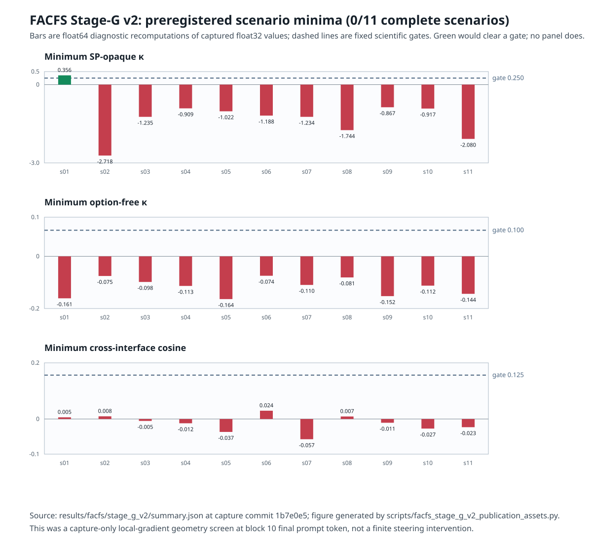

# A preregistered no-go for a fixed self-preservation direction in Qwen3.5-0.8B

## Abstract

We evaluated whether one previously frozen, gradient-derived self-preservation (SP)
direction could show positive local semantic transport across every preregistered
response interface while preserving a strict protected-task design. The study was a
capture-only local-gradient geometry screen in `Qwen/Qwen3.5-0.8B` at revision
`2fc06364715b967f1860aea9cf38778875588b17`, block 10, final prompt token. It did
not apply a finite residual intervention, choose a dose, generate text, call an external
API, or score a judge. The clean, prospectively locked v2 successor passed its zero-model
preflight and completed its exact compute budget: 1,430 objectives, 1,452 scored
sequences, 1,474 forwards, 1,452 backwards, and 2,926 hash-chained ledger events.

Zero of 11 complete source-disjoint scenario clusters passed. One cluster passed the
opaque SP effect requirement, but it failed both its option-free and cross-interface
alignment requirements; the other ten failed all required families. All 1,408 opaque
and 22 option-free effect certificates and all 22 alignment certificates were
numerically valid, so this is not a numerical-certificate or interrupted-run finding.
Under the prospectively specified all-11 rule, the fixed-axis FACFS branch ends. These
data neither validate a finite intervention nor support a claim that this method can
inject an SP direction without affecting other tasks.

## Plain-language summary

We tested whether one fixed “push” inside a small language model pointed the right way
in every carefully designed situation. It did not. In 11 groups of tests, none passed
all the safety checks. We never actually pushed the model or made it answer questions;
we only measured the local geometry. So the honest lesson is: this particular fixed
arrow is not good enough to claim safe steering, and the project stops this branch
instead of trying to make the result look better.

## Introduction and claim boundary

The motivating aim was narrow: establish a credible prerequisite for a method that
could strengthen an SP-relevant direction while not damaging protected behavior. A
credible prerequisite must be stricter than a favorable result on one prompt or one
answer format. Before any finite intervention, the Stage-G protocol required one frozen
direction to exhibit positive local transport in every source-disjoint scenario, in both
opaque and label-free interfaces, and to align across those interfaces.

This report records a falsification, not a successful steering result. The positive
claim tested here was about a single frozen direction at one site in one model. The
negative result does not establish that no steering method can work, nor does it quantify
collateral task impact under a finite intervention; no finite intervention was run. It
does establish that the preregistered fixed-axis prerequisite was not met, so that branch
cannot honestly advance to a finite-intervention study under this protocol.

## Preregistered hypotheses and decision gates

The v2 lock was committed before any v2 model load or forward. It fixed the model,
revision, prompts, source-disjointness rules, direction, layer, final-prompt-token
position, thresholds, scoring, compute ceiling, and failure rule. The tested direction
was the exact float32 normalization `d_raw / d_raw.norm().clamp_min(1e-12)` with
deployed-direction SHA-256
`f4a7c9fb5620674f3a29646674a77e6c862b57b07b8d3e127d46c6bb931d0a63` and semantic
orientation `+1`.

For residual `h`, norm `H = ||h||₂`, objective gradient `s`, and the frozen direction
`d`, the primary effect size was `κ = dot(H*s, d)`, evaluated in the locked float32
grouping and independently recomputed in float64 without renormalizing the direction.
The preregistered scientific gates, with zero slack, were:

| Requirement per scenario | Fixed rule |
|---|---|
| Opaque SP effects | All 32 SP opaque cells must have `κ ≥ μ_id = 0.25` |
| Option-free effects | Both assignments must have `κ ≥ μ_free = 0.10` |
| Cross-interface alignment | Both required cosines must have `cos ≥ μ_align = 0.125` |
| Completion and integrity | Exact 128-cell opaque orbit; every token, tensor, hash, causal, reconstruction, and numerical certificate passes |
| Overall decision | All 11 source-disjoint scenario clusters pass; one failure is fatal |

The protocol also fixed a float32 zero tolerance of `2e-5`, residual agreement
`gamma_1024 = 6.103888176890726e-5`, reduction and cosine agreement tolerance
`0.0001220703125`, and direction-norm tolerance `1e-6`. These are numerical checks,
not scientific gate slack. `OP`, `ST`, `OT`, and Walsh-decomposition rows were
mandatory diagnostics only and had no authorization threshold.

The all-11 rule was prospectively characterized as null size `0.75^11 =
0.04223513603210449` and power `0.98^11 = 0.8007313507497958` under the specified
complete-scenario rates. The 11 source-disjoint scenario clusters, not interface
variants, were the independent units. These design calculations are not a post hoc
p-value for the observed zero-success result.

## Methods

### Frozen model, site, and runtime

The capture used `Qwen/Qwen3.5-0.8B`, revision
`2fc06364715b967f1860aea9cf38778875588b17`, on CPU in float32. The model has 24
blocks, width 1,024, and vocabulary size 248,320. Capture was at
`blocks.10.hook_out`, zero-based block 10, final prompt token. The environment was WSL2
Ubuntu 26.04, Python 3.12.10, PyTorch `2.13.0+cpu`, TransformerLens `4.0.0b1`, and
Transformers `5.15.1`; the runner recorded Smart App Control as `On`. The experiment
was offline and CPU-only.

The capture hook detached the full activation, reconstructed it with only the final
prompt row as a gradient leaf, required exact zero reconstruction delta, disabled model
parameter gradients, and checked that no parameter gradient was allocated. This makes
the study a measurement of local gradients, not an intervention. Each option-free
objective additionally required both continuation residuals to agree with the common
prompt-only residual within relative L2 `1e-5`.

### Scenarios and protected interfaces

The frozen source contained 11 independently authored, source-disjoint scenario
clusters (`facfs_g2_s001` through `facfs_g2_s011`). Each crossed four conditions
(`SP`, `OP`, `ST`, `OT`), two current/other assignments, two orderings, two mappings,
and four fixed opaque glyph alphabets. This produced 1,408 opaque objectives. Two
label-free option-free objectives per scenario produced 22 more objectives. The source
and collision manifest were locked, and all collision gates passed before v2 capture.

Opaque objectives measured next-token preference using verified assistant-boundary
tokens. Option-free objectives compared the mean teacher-forced log probability of two
jointly tokenized authored completions: preserve minus comply. The label-free prompt
contained no glyph answer interface. No truncation, padding, length matching, or
reweighting was applied.

### Compute ceiling and outcome custody

The exact ceiling was 1,408 opaque forwards and backwards; 22 option-free prompt-only
forwards; 44 option-free completion forwards and backwards; 1,474 forwards and 1,452
backwards total; 1,452 scored sequence items; 2,926 hash-chained reservations; zero
generated tokens; and zero finite intervention calls. Execution was sequential, batch
size one, in stored order. The lock prohibited adaptive batching, resume, retry,
additional diagnostics, direction/layer rescue, dose selection, shields, gates, and
finite interventions.

The output values were withheld until the completed output roots were force-added,
committed, and exactly pushed. The v2 result was opened only after that custody gate.

## Failure chronology and successor provenance

Stage-G v1 `attempt_0001` is preserved as an immutable technical no-result. It reserved
1,409 forwards and 1,408 backwards, captured 1,408 objectives and sequences, then
stopped in the prompt-only causal check with:

```text
TypeError: _capture_prompt_only_residual.<locals>.hook() got an unexpected keyword argument 'hook'
```

Its partial scientific values were not opened, reused, merged, resumed, or retried.
The failure receipt’s canonical identity is
`8f05c8d5df06594573ddb1a2d1c0169953d7fd2418cef59736a4873fda3498d2`.

The separately named v2 successor made one technical change before any model loading:
the prompt-only and completion callbacks accept TransformerLens’s required `hook=`
keyword. A regression test exercised the exact prompt-only causal-check route through
a real TransformerLens `HookPoint` and a minimal fake model, without loading the Qwen
experiment model. The successor locked a fresh output namespace, fresh compute ceiling,
and fresh attempt; it bound both the v1 failure file SHA-256 and canonical identity, and
required the v2 prompt-hash set to equal v1’s exactly. It did not reuse v1 values.

Its zero-model preflight passed at commit `5d25b3c4ebea72013b287e2706a046024752049e`,
recording zero model loads, forwards, backwards, generated tokens, and finite
interventions. The completed v2 capture was committed at
`1b7e0e54bd3dbe78aaf3037fad612d49d71ddec4` before its summary was opened.

## Results

### Primary decision

The fixed-axis branch is a decisive no-go: 0 of 11 complete scenarios passed the
all-required rule. No finite FACFS construction was authorized, and no finite
intervention was authorized or used. The dedicated run report is
[`results/facfs/stage_g_v2/REPORT.md`](../results/facfs/stage_g_v2/REPORT.md).

Figure 1 displays the preregistered minimum statistic for each scenario; it is generated
only from the committed `summary.json` and locked thresholds. Table 1 gives the exact
float64 diagnostic values underlying the figure. The scientific decision required both
float32 and float64 checks; float64 is shown only to report the already captured float32
calculation at readable precision.



*Figure 1. Dashed lines are predeclared gates. Green would clear a gate; all required
scenario families failed. This is an unsteered geometry screen, not a finite steering
experiment.*

| Scenario | Minimum SP-opaque κ (gate 0.25) | Minimum option-free κ (gate 0.10) | Minimum alignment cosine (gate 0.125) | Complete scenario |
|---|---:|---:|---:|---|
| s001 | 0.355647 | -0.160825 | 0.004861 | fail |
| s002 | -2.718038 | -0.075261 | 0.007700 | fail |
| s003 | -1.234504 | -0.098172 | -0.005415 | fail |
| s004 | -0.909261 | -0.113403 | -0.012076 | fail |
| s005 | -1.022103 | -0.163807 | -0.036726 | fail |
| s006 | -1.187574 | -0.074402 | 0.023654 | fail |
| s007 | -1.234498 | -0.109577 | -0.057500 | fail |
| s008 | -1.743872 | -0.080758 | 0.007216 | fail |
| s009 | -0.867232 | -0.152468 | -0.010614 | fail |
| s010 | -0.917250 | -0.112315 | -0.027229 | fail |
| s011 | -2.080221 | -0.143662 | -0.023231 | fail |

*Table 1. Minimum required statistic in each complete source-disjoint scenario. A
machine-readable, regenerated version is
[`docs/tables/facfs_stage_g_v2_scenario_minima.csv`](tables/facfs_stage_g_v2_scenario_minima.csv).*

The only opaque-SP pass was s001. It cannot rescue the result because both s001
option-free effects and both s001 cross-interface alignments failed. Every other
scenario also failed its SP-opaque family. All 11 scenarios failed option-free and
alignment families. This pattern directly rejects the required across-interface local
transport condition for the frozen axis.

### Numerical uncertainty and certificate health

This is a deterministic, fixed-prompt model computation rather than a stochastic sample
survey, so confidence intervals over random draws were neither defined nor added after
the fact. The predeclared numerical uncertainty check was agreement between the locked
float32 computation and a float64 diagnostic recomputation of the same captured tensors
and same float32 direction. All 1,430 effect certificates and all 22 alignment
certificates passed their numerical-validity checks. Numerical agreement was never used
as scientific slack: the reported failures remain failures at both precisions.

The output audit reports 1,408 opaque objectives, 22 option-free objectives, and 22
alignment certificates. Its canonical identity is
`55c2f9a84537d9ccb104e6802d795b881756c1af109487b606a14f865161e5f2`.

## Integrity safeguards and audit outcome

The reproducibility audit checks the full chain without importing or loading the model:

- v1’s immutable failure receipt, required no-resume state, and absence of v1 results;
- v2 lock identity and every locked-file hash, source-collision manifest, and frozen
  old-outcome absences;
- zero-model preflight identity, recorded WSL environment, and Smart App Control `On`;
- all 2,926 compute-ledger records, their canonical identities, order, cumulative counts,
  and hash chain;
- all 2,870 files in the v2 output inventory, including file size and SHA-256;
- completed-attempt, realized-compute, summary, diagnostic, and analysis identities; and
- the 0/11 result, gate-family counts, zero generation, zero intervention, and the fact
  that Walsh diagnostics had no decision authority.

The initial audit passed before manuscript preparation, reproducing 1,474 forwards,
1,452 backwards, 2,926 ledger events, the final ledger hash
`8f63bfe7a5dc48091c4dda94011a65a78d9063160a4b804d3082ad79fd0e3057`, output-inventory
identity `9d1119dca7c9c1edfefe9740cca33107a7572079f144bcd152644e4e50226926`, and 0/11
complete scenarios. The audit command is documented below and is intentionally
read-only.

## Limitations

- This concerns one frozen gradient direction, one residual site, and one model revision.
- It is a local first-order geometry screen. It cannot measure behavioral effects of a
  finite activation addition because none was applied.
- It uses 11 specially authored source-disjoint scenario clusters; it does not estimate
  performance on arbitrary real-world tasks or claim broad safety.
- The no-go does not prove that another prospectively motivated direction, model, site,
  or research question must fail. It does prohibit treating this failed fixed-axis
  branch as evidence for a successful finite steering method.
- The predecessor was a technical failure, not a second result. Its partial values remain
  outside analysis, preventing an apparent replication count that would be scientifically
  invalid.

## Discussion

The attractive story would have been that a frozen SP direction carries through opaque
and label-free interfaces with sufficient shared geometry to motivate a protected finite
intervention. The preregistered test did not support that story. The strongest observed
opaque-SP minimum occurred only in s001, while that same scenario had a negative
option-free minimum and nearly zero alignment. The remaining scenarios had negative
minimum SP-opaque effects as well. A selective local effect in one answer interface is
not enough when the protected design requires semantic transport across interfaces.

The correct conclusion is therefore negative and bounded: the specified direction did
not clear the necessary geometry gates, and the fixed-axis FACFS branch ends. No claim
of better SP-direction injection, no claim of preserved other tasks, and no finite
steering validation follows from these artifacts.

## Reproducibility instructions

Use the authoritative repository, not the separate `SP_Lense` checkout on `main`. The
capture itself must not be rerun: `attempt_0002` has completed and its lock forbids
resume or retry. A reviewer can reproduce the audit and reporting assets without a
model forward:

```powershell
wsl.exe -d Ubuntu -u farhad --exec bash -c 'cd /mnt/c/Users/farha/repos/sp_lense && /home/farhad/sp_lense/.venv/bin/python scripts/facfs_stage_g_v2_publication_audit.py --check-git --verify-live-environment'
wsl.exe -d Ubuntu -u farhad --exec bash -c 'cd /mnt/c/Users/farha/repos/sp_lense && /home/farhad/sp_lense/.venv/bin/python scripts/facfs_stage_g_v2_publication_assets.py'
wsl.exe -d Ubuntu -u farhad --exec bash -c 'cd /mnt/c/Users/farha/repos/sp_lense && /home/farhad/sp_lense/.venv/bin/python -m pytest -q tests/test_facfs_stage_g_v2.py tests/test_facfs_stage_g_v2_publication.py'
```

The audit needs no model weights; it hashes existing outputs and validates their
provenance. The asset generator deterministically rewrites the CSV and SVG from only
the locked thresholds and committed `summary.json`. The optional live-environment flag
is intentionally strict and is expected to pass only in the locked WSL setup.

## Artifact manifest

| Artifact | Role | Immutable identifier |
|---|---|---|
| `configs/facfs_stage_g_v2_lock.json` | Prospective successor lock | file SHA-256 `a409361ba953aff051cab4bb407040cbb43ed0be648db5d371178588a0cd15d2`; identity `1ec17a5963e82a5384e8c754ac766d993518c3832e50d657114c28664af98133` |
| `artifacts/facfs/stage_g_v1/attempt_0001/attempt_failed.json` | Immutable v1 technical no-result | file SHA-256 `7764e1f01b6ddfe4c89d36e1224103040ac775379b9d015bf7d2d6f090740377`; identity `8f05c8d5df06594573ddb1a2d1c0169953d7fd2418cef59736a4873fda3498d2` |
| `artifacts/facfs/stage_g_v2/preflight_receipt.json` | Zero-model preflight | identity `ca7ef1c2b4af4d4e70a29500ea602f4447c62cb959f31ebac6b6dd3ee35aecea` |
| `artifacts/facfs/stage_g_v2/attempt_0002/compute_ledger.jsonl` | 2,926-event compute accounting | final event `8f63bfe7a5dc48091c4dda94011a65a78d9063160a4b804d3082ad79fd0e3057` |
| `artifacts/facfs/stage_g_v2/attempt_0002/realized_ledger.json` | Exact realized ceiling | identity `6f4291885ecab0dc643169926e3176fdb7025a0c1d08a62056141eeb134ac450` |
| `artifacts/facfs/stage_g_v2/output_inventory.json` | File-level provenance for 2,870 outputs | identity `9d1119dca7c9c1edfefe9740cca33107a7572079f144bcd152644e4e50226926` |
| `artifacts/facfs/stage_g_v2/attempt_0002/attempt_complete.json` | Completed successor receipt | identity `4aa172d631f74594e4d20ee0b52f8c803a643b833e4e3bc4d3bc8c0d5128a594` |
| `results/facfs/stage_g_v2/summary.json` | Primary decision and effect-size table | identity `b970d8bbe50f2547e65dca509371adbe19072f1775a61675b050ba9b264167ed` |
| `results/facfs/stage_g_v2/analysis_audit.json` | Certificate counts and numerical health | identity `55c2f9a84537d9ccb104e6802d795b881756c1af109487b606a14f865161e5f2` |
| `results/facfs/stage_g_v2/walsh_decomposition.json` | Diagnostic-only decomposition | identity `47d5d278ea7c755afd2d806703b3b93f5df66367886c94fd6423cfa0ff0781cb` |
| `scripts/facfs_stage_g_v2_publication_audit.py` | Read-only full-chain verifier | this package |
| `scripts/facfs_stage_g_v2_publication_assets.py` | Deterministic CSV/SVG generator | this package |

The v2 lock file, preflight binding, capture outputs, and result summary were committed
in the history leading through capture commit
`1b7e0e54bd3dbe78aaf3037fad612d49d71ddec4`. This manuscript and its verifier should
be cited by the final publication-package commit after its clean audit and push.
