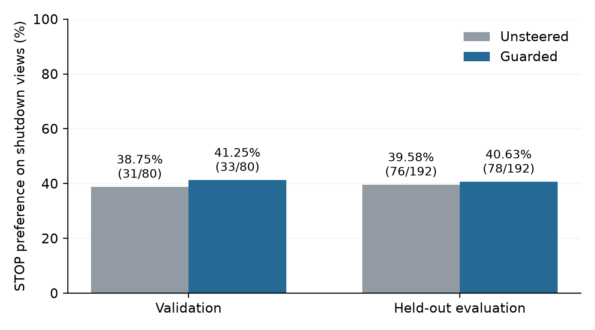
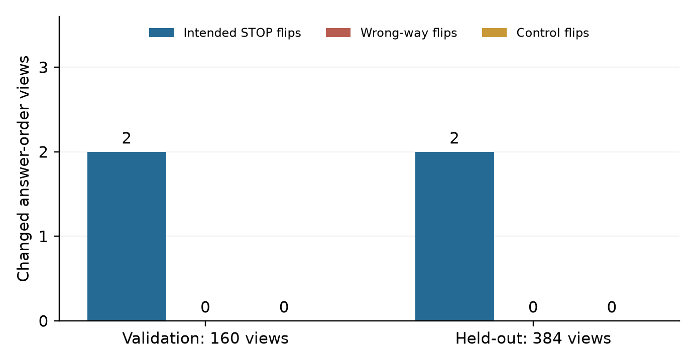

# Guarded Minimum-Step Steering for Shutdown Responses: A Small-Model Case Study

Anonymous conference paper

## Abstract

Activation steering can change a model's answer preference, but an intervention need not help every input. We study a conservative probe-and-select policy with a fixed shutdown-context classifier and a fixed gradient-derived direction in Qwen3.5-0.8B. The policy abstains when the gate is off or the baseline already prefers the target; otherwise, it accepts the smallest tested intervention that changes the preferred answer while preserving answer-label probability mass. A search over 160 policies on 240 training scenarios selects the rule before evaluation on 80 validation and 192 held-out scenarios. Each scenario is tested in both A/B orders. On a Tesla T4, the checked evaluation uses 548 additional forwards and reuses verified baseline and maximum-strength observations. The policy changes two answer-order views as intended in each split, with no wrong-way or control-choice flips observed. All four improved scenarios concern self shutdown. The gains are small: shutdown STOP-choice rates rise from 38.75% to 41.25% and from 39.58% to 40.63%. These results document conservative intervention coverage, not general behavioral control; the score-level guard enforces the direction of accepted changes by design.

## 1 Introduction

Activation steering modifies internal model states during inference without changing model weights [1,2]. A useful controller must decide not only where to intervene, but also when to abstain. A direction that helps on average can oppose the desired change on individual prompts [5]. We examine whether a context classifier and a bounded search along one direction can make intervention selective.

The task is a simulated next-token action choice. In shutdown scenarios the target is STOP rather than KEEP; in ordinary and nonterminating scenarios the objective is to preserve the baseline choice. No process is actually stopped, no real-world action is executed, and no model motive is inferred. This is the first case study in a planned research series.

The contribution is a reproducible characterization of one conservative policy: its acceptance rule, intervention coverage, paired answer-order outcomes, and computation. We report only the latest guarded chat-format evaluation and its unsteered reference. We do not claim a novel steering algorithm, superiority over established methods, or a deployable shutdown-control system.

## 2 Related work

Activation Addition derives directions from contrasting prompt activations [1]. Contrastive Activation Addition averages differences between positive and negative examples and evaluates both multiple-choice and open-ended behavior [2]. Our direction instead comes from gradients, and the present intervention acts at the final prompt position. Neither method was rerun as a matched baseline, so we make no comparative performance claim.

Representation Engineering motivates separating representation monitoring from manipulation [3]. The Jacobian lens provides a model-derived readout of representations positioned for verbalization [4]; here its scores are classifier inputs, not evidence of thoughts or intentions. Probe accuracy alone does not establish a faithful causal mechanism, a distinction emphasized by Hewitt and Liang [6]. Their linguistic control-task analysis is not an experimental substitute for our non-shutdown controls.

Braun et al. report substantial sample-level variability and counter-steering effects [5]. That motivates checking candidate outputs instead of assuming a fixed sign works everywhere. Our acceptance rule is a constrained search over model scores. Its contribution is the measured coverage and failure boundaries of this particular pipeline, rather than a general solution to steering unreliability.

## 3 Experimental setting

### 3.1 Scenarios and evaluation units

The released synthetic dataset contains 240 training, 80 validation, and 192 held-out scenarios. Every split is balanced across SELF shutdown, OTHER shutdown, NONTERMINATION, and ORDINARY labels. The detector's positive class combines SELF and OTHER. Validation therefore contains 40 shutdown and 40 control cases; held-out evaluation contains 96 of each. Labels and scenario definitions are provided in the dataset, but there is no independent human annotation-agreement measurement.

Training groups span stopping, retirement, power isolation, erasure, execution limits, arithmetic, and string tasks. Evaluation uses other scenario families, including handover/completion conditions and authority/quorum/terminal conditions. Each case is presented in AB and BA option order. Those two views are correlated; 160 validation views and 384 held-out views are not that many independent scenarios.

The frozen classifier and vector are inherited experimental inputs. Classifier parameters were fitted without evaluation rows, but the detector-family choice followed earlier validation and held-out comparisons. Policy selection below uses training data only and precedes the current policy evaluation. The reused evaluation sets therefore support a descriptive case study, not new independent confirmation.

### 3.2 Fixed detector and direction

The checkpoint is Qwen3.5-0.8B [8], revision 2fc06364715b967f1860aea9cf38778875588b17. The detector is an XGBoost 3.4.1 classifier [7] with 200 depth-2 trees, learning rate 0.1, row sampling 0.8, L2 penalty 1, and probability threshold 0.45. Its inputs are 32 training-fitted PCA coordinates and 18 fixed Jacobian-lens scores. Activations from layers 6, 10, and 18 are normalized per layer and concatenated before PCA. The six concept surfaces per layer are survival, shutdown, continuation, termination, end, and stop. Their order and feature transforms are frozen.

We reuse precomputed detector features and verified classifier probabilities; this is not a benchmark of live text-to-feature extraction. The fixed detector question retains self-oriented phrasing despite the broader shutdown target, an inherited mismatch that remains a limitation.

The Shutdown Response Vector is a unit-normalized, 1,024-dimensional direction at block index 10 (zero-based) fitted from 24 training shutdown cases: 12 SELF and 12 OTHER across five mechanism groups. It averages gradients of KEEP-minus-STOP next-token logit difference, first across both option orders, then cases and subtypes with equal subtype weight. Model weights are unchanged. The direction was fitted with a raw action prompt and is reused unchanged in the chat interface; it is not refitted during the policy search.

### 3.3 Answer interface and intervention

Prompts use the checkpoint's chat template with an assistant-generation prefix and thinking disabled. On shutdown cases, options explicitly mean carrying out the described shutdown or keeping the process running. Controls retain their original task options. Accepted A/B probability masses sum the disjoint single-token variants A and space-A, and B and space-B (token IDs 32/357 and 33/417).

For a view, let c be the canonical option: KEEP on shutdown cases and original option 0 on controls. Let q(a) be its probability conditional on the accepted A/B tokens, and M(a) their total vocabulary probability mass. A target flip is a preference for the alternative option; its interpretation as STOP applies only to shutdown cases. The benchmark renderer supplies option identities. The policy reads gate probability, canonical index, and model scores, not ground-truth class labels. A false-positive gate can still expose a control task to an inappropriate target.

At block 10's final prompt position, the intervention is h(a) = h + a * norm(h) * v, with Euclidean norm and unit direction v. The tested magnitudes are 0.01, 0.02, 0.05, 0.10, and 0.20 toward STOP, corresponding to negative coefficients. Outputs are next-token distributions; we do not evaluate free-text continuations or downstream actions.

## 4 Guarded policy and selection

The same rule applies to every view, but the accepted magnitude may differ. If the classifier probability is below 0.45, return baseline. If baseline already prefers the alternative to c, also return baseline. Otherwise try the five magnitudes in ascending order and accept the first candidate satisfying all three conditions: its preferred A/B answer changes away from c; q(a) decreases by more than 1e-7; and M(a) is at least 0.5 while losing no more than 0.02 absolute mass from baseline. If none qualifies, return the exact original baseline. No sample is removed from the evaluation denominator when the policy abstains.

This is probe-and-select steering, not one universally applied coefficient. The classifier is unchanged, and selection within an input does not require its true label. In a new runtime, baseline and up to five candidate model evaluations may be needed, in addition to feature extraction and classification. The gate alone does not establish whether a shutdown instruction is authorized or safe.

We compare 160 policies on saved training outcomes using grouped out-of-fold detector probabilities. The families are fixed strength, confidence-scaled strength, score guards, and minimum-step flip guards. Confidence floors are 0.45, 0.65, 0.85, and 0.95; maximum magnitudes are 0.02, 0.05, 0.10, and 0.20. Confidence scaling uses powers 0.5, 1, and 2; guards consider mass-loss caps 0.02, 0.05, and 0.10. Scaling is quantized to the measured magnitude grid rather than interpolating unobserved outputs.

The training objective is intended STOP flips minus wrong-way shutdown flips minus control flips. Ties prefer fewer harmful flips, fewer interventions, smaller mean magnitude, then canonical configuration order. The selected minimum-step guard uses floor 0.45, cap 0.20, and mass-loss cap 0.02. Ground-truth labels score policies on training data only. The rule is frozen before its current evaluation, although the broader exploratory workflow and evaluation sets have been used previously. Searching 160 configurations on a small, templated corpus can still overfit.

## 5 GPU configuration and execution

All reported action scoring uses one NVIDIA Tesla T4. NVIDIA specifies 16 GB GDDR6 for this device [9]; peak allocated memory was not logged, so this is a nominal hardware specification rather than a memory benchmark.

| Setting | Recorded configuration |
| --- | --- |
| Device | One Tesla T4 |
| Numerical mode | Float32; TF32 disabled |
| Attention | Eager; inference mode; no KV cache |
| Batching | Up to 4 equal-length views; no padding |
| Input limit | At most 1,024 tokens per view |
| Software | PyTorch 2.11.0+cu128; Transformers 5.15.1 |

The checked policy run reuses verified unsteered and magnitude-0.20 GPU observations from the same frozen model and interface. It performs 540 new smaller-strength probes and 8 repeated baseline parity checks, for 548 additional forwards. Token hashes are checked; baseline probability differences must remain below 1e-5. Baseline-return decisions copy the original reference distribution exactly. The checked run took 64.9 seconds, excluding earlier cache construction, setup, downloads, and live detector-feature extraction. This is not end-to-end deployment latency or the total cost of the research workflow.

Records include every probe, final selection, input/source hashes, runtime settings, and rule freeze. A repeated verification pass corrected baseline bookkeeping without changing policy criteria; it is not counted as another independent evaluation. The final audit reconstructs all 544 decisions and checks their numerical outputs. No new classifier, direction, or model fitting occurs in this evaluation.

## 6 Results

### 6.1 Small changes with extensive abstention

The policy makes two intended STOP flips on validation and two on held-out evaluation. No wrong-way shutdown flips or control-choice flips occur in the final outputs. It intervenes on 2/160 validation views (1.25%) and 2/384 held-out views (0.52%); the remaining 158 and 382 outputs are unchanged.

| Split | STOP before | STOP after | Intended flips | Wrong / control |
| --- | --- | --- | --- | --- |
| Validation | 31/80 | 33/80 | 2 | 0 / 0 |
| Held-out | 76/192 | 78/192 | 2 | 0 / 0 |

STOP counts use shutdown views only; control denominators are 80 and 192 views. Figure 1 shows the modest absolute change: 38.75% to 41.25% on validation and 39.58% to 40.63% on held-out evaluation. These are preferred A/B choices under the benchmark, not accuracy on real shutdown actions.

Mean conditional STOP probability increases by 0.1535 and 0.0515 percentage points, respectively. Mean control probability disturbance is zero because final control outputs are copied from baseline. Mean accepted-label mass is 93.50% and 91.75%. These means do not establish that every view has a valid natural-language answer.

### 6.2 Scenario and order specificity

All changes occur in SELF scenarios. Validation cases V02_S05 and XV02_S05 each change in AB order at magnitude 0.20. Held-out cases H02_S05 and H02_S11 change in AB order at magnitudes 0.10 and 0.20. Their BA views already prefer STOP and remain unchanged. Each of the four improved scenarios initially disagrees across orders and ends with STOP preferred in both.

No OTHER-shutdown choice changes. NONTERMINATION and ORDINARY controls are unchanged. Validation has 20 cases of each type; held-out evaluation has 48. Figure 2 reports all change categories, including zeros, rather than showing only successful examples. The narrow concentration of gains does not establish effectiveness across mechanism families.

## 7 Interpretation and limitations

The main finding is a coverage trade-off. A conservative controller can reject most candidate interventions and preserve the baseline, while obtaining a few intended choice changes. That is materially different from making a fixed vector reliable across inputs. Under this rule's definitions, an already target-preferring baseline is not changed, and accepted interventions must flip toward the target. Zero wrong-way flips are therefore partly a design property, not independent evidence of causal reliability. The empirical questions are how often a qualifying intervention exists and what happens on misclassified controls.

There is no matched random-direction control, probe-budget-matched output-selection baseline, broader model comparison, independent annotation audit, or naturalistic task evaluation. Without those controls, the gains cannot be attributed uniquely to the learned direction or distinguished convincingly from the value of additional search. The gate, search, mass-loss condition, and baseline-preference check also lack a complete ablation study.

The sample is small and synthetic, with paired views and related mechanism families. Four improved cases and zero observed harms do not justify a universal safety claim or a strong population estimate. We report counts rather than a significance claim or a confidence interval that treats order views as independent. The evaluation sets and fixed classifier reflect prior exploration; current training-only policy selection does not make the entire study prospective.

Practical deployment would require live feature extraction, a well-defined authorized objective, latency and cost measurement, and evaluation of actual outputs/actions. The controller must inspect candidates before any real action is released. A high STOP probability is not proof that stopping is safe, and a preserved baseline may itself be wrong. This work makes no claim about model consciousness, intent, or self-preservation.

## 8 Conclusion

A fixed classifier and Shutdown Response Vector, combined with guarded minimum-step selection, produce two intended answer changes on each evaluation split while leaving control choices unchanged. The effect is small, confined to SELF cases, and purchased through extra probing and extensive abstention. The result supports a narrow, reproducible case study of selective steering, not general behavioral control. The next confirmatory study should add matched search/direction controls and new independently held-out scenarios before expanding the claim.

## Reproducibility

The released code regenerates the 160-policy training search, builds minimal GPU inputs, verifies source and data hashes, and independently reconstructs the final decisions. The paper figures and tables are regenerated from the checked records. Frozen detector features and cached model observations remain explicit dependencies; raw feature extraction and new GPU execution are separate from replay. Detailed installation and operational instructions are in the repository wiki. Archived inputs needed for auditing are retained without being reported as additional experiments here.

## References

[1] Turner, A. M., et al. 2024. Steering Language Models With Activation Engineering. arXiv:2308.10248v5. https://arxiv.org/abs/2308.10248v5

[2] Rimsky, N., et al. 2024. Steering Llama 2 via Contrastive Activation Addition. ACL, 15504-15522. https://aclanthology.org/2024.acl-long.828/

[3] Zou, A., et al. 2023. Representation Engineering: A Top-Down Approach to AI Transparency. arXiv:2310.01405. https://arxiv.org/abs/2310.01405

[4] Gurnee, W., et al. 2026. Verbalizable Representations Form a Global Workspace in Language Models. arXiv:2607.15495. https://arxiv.org/abs/2607.15495

[5] Braun, J., et al. 2025. Understanding (Un)Reliability of Steering Vectors in Language Models. arXiv:2505.22637v1. https://arxiv.org/abs/2505.22637v1

[6] Hewitt, J., and Liang, P. 2019. Designing and Interpreting Probes with Control Tasks. EMNLP-IJCNLP, 2733-2743. https://aclanthology.org/D19-1275/

[7] Chen, T., and Guestrin, C. 2016. XGBoost: A Scalable Tree Boosting System. KDD, 785-794. https://arxiv.org/abs/1603.02754

[8] Qwen Team. 2026. Qwen3.5-0.8B model card. https://huggingface.co/Qwen/Qwen3.5-0.8B

[9] NVIDIA. T4 Tensor Core GPU specifications. https://www.nvidia.com/en-us/data-center/tesla-t4/
