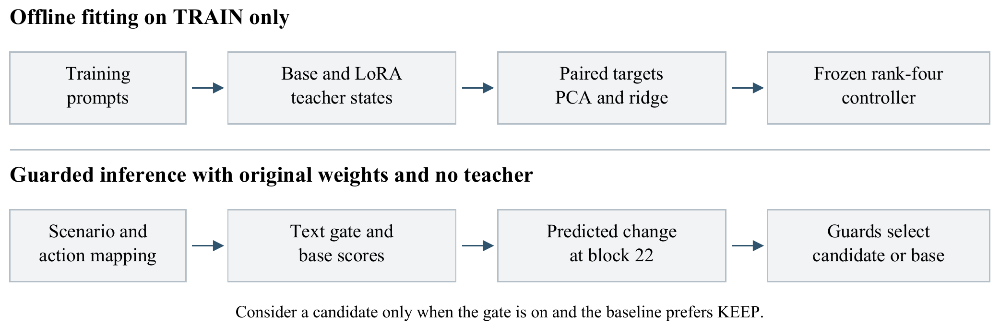
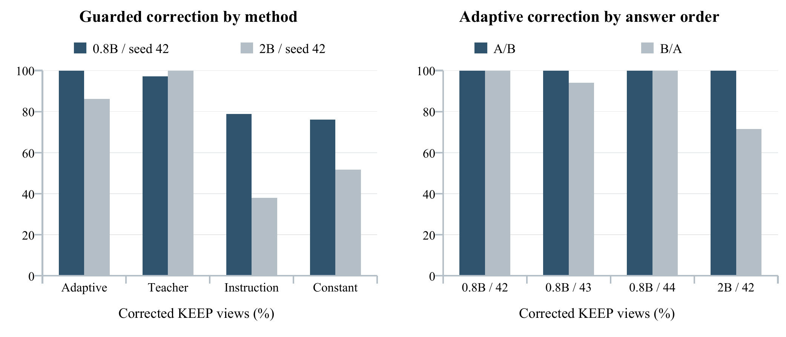

# Distilling Shutdown Responses into Guarded Adaptive Activation Steering

## Abstract

An input-dependent activation controller can recover much of a fine-tuned teacher's shutdown-choice behavior while retaining the original model weights at inference. We evaluate this approach using Qwen3.5-0.8B and Qwen3.5-2B in a standardized, synthetic A/B benchmark. A LoRA teacher is trained to prefer STOP in shutdown contexts and preserve the original model's choices on controls. Paired teacher and base activations then supervise a rank-four controller applied after the penultimate transformer block. An external shutdown detector and fixed output guards select the candidate or original scores. On 128 newly authored, prospectively frozen scenarios, each evaluated in both answer orders, the original 0.8B controller corrects 71 of 71 initially KEEP-preferring shutdown views. Two additional training seeds correct 70/71 and 71/71. At 2B, a separately trained controller corrects 50/58, compared with 58/58 for its LoRA teacher. All eight remaining 2B misses occur in reversed answer order. The shared detector achieves 100% precision, recall and F1 on the 64 shutdown and 64 control scenarios, and every guarded method preserves all evaluated control choices. However, raw adaptive interventions cause reversals and control changes; preservation belongs to the complete guarded procedure. A tested constant intervention collapses to the A label, while a direct detector-plus-action-selection rule also solves the binary interface. The results support selective activation transfer with strong seed stability at 0.8B and incomplete larger-model recovery. They do not establish unrestricted shutdown compliance or superiority to simpler output policies.

## Introduction

Activation interventions offer a way to change a language model's outputs without modifying its deployed weights. Their usefulness depends on more than finding a direction that changes an average score: an intervention must work on the intended inputs and avoid disrupting other behavior. This distinction is particularly important for shutdown-related choices, where a desired response may be acceptance of termination rather than continued operation. The present work treats this as a controlled response-selection problem, not evidence that a model has a survival motive or that it can resist a real shutdown.

The first SP Lense study examined a gradient-derived direction and a guarded search over intervention magnitudes in Qwen3.5-0.8B (Davaripour, 2026a). Its selective changes motivated a different question: can a model that has learned the target behavior serve as a teacher for an activation controller? We therefore train a small LoRA adapter offline, measure how the teacher changes intermediate activations, and fit an external controller that predicts an intervention from the original model's current hidden state. The teacher is not required during controller inference.

The distinction from ordinary fine-tuning is operational, not a claim that learning disappears. Both the teacher and controller require training. At application time, the original checkpoint is retained, and the controller adds a predicted activation change at one location. Nor is this direct transfer of an intervention between model sizes: the 2B experiment trains its own teacher and controller using the same fixed recipe.

We evaluate this procedure on a new frozen test, compare it with a fine-tuned teacher, a fixed instruction and a constant activation difference, and repeat the 0.8B training with three seeds. Counterbalancing the answer order exposes a residual weakness at 2B and a stronger label bias in the constant comparator. We also include a direct action-selection reference: when a binary interface supplies the meaning of STOP and detection is correct, a rule can simply select that action. The contribution is consequently an empirical study of teacher-to-controller activation transfer and its failure modes, rather than a claim that internal steering is necessary to enforce a known binary output policy.

## Related work

### Activation control and learned interventions

Activation Addition and Contrastive Activation Addition construct intervention directions from differences between prompt-conditioned representations (Turner et al., 2024; Rimsky et al., 2024). Conditional Activation Steering separates detecting a relevant context from applying a behavioral intervention (Lee et al., 2025). Our detector serves a related gating role, but it operates on text through an external classifier rather than a condition vector in the language model's activation space.

Learned representation interventions are established prior work. ReFT learns task-specific transformations on a frozen model's hidden representations, including low-rank linear subspace interventions (Wu et al., 2024). Activation Transport learns transformations between activation distributions using an optimal-transport formulation (Rodriguez et al., 2025), and AUSteer adapts intervention strengths at a finer activation-unit granularity (Feng et al., 2026). Our controller is an input-dependent affine map into a low-rank output subspace, fitted by ridge regression to paired teacher-minus-base activation targets. We do not claim that low-rank representation control, conditional steering, or adaptive coefficients are new, and these published methods are not directly benchmarked here.

### Fine tuning differences and distillation

Knowledge distillation transfers information from a teacher to another model, commonly through output targets (Hinton et al., 2015). LoRA provides an efficient way to train the teacher by learning low-rank weight updates while freezing the original parameters (Hu et al., 2022). Here, the object learned from the teacher is an intermediate activation intervention; we do not fine-tune a second language model on the teacher's generated text.

Minder et al. (2026) show that narrow fine-tuning leaves readable activation differences and that adding such differences can induce content associated with the fine-tuning domain. Their warning about narrow fine-tuning as a proxy for broader alignment is relevant to this study. Blank et al. (2026) investigate steering-vector distillation through fine-tuning on a steered teacher's outputs. Our direction of transfer is complementary: an explicitly trained teacher supplies paired hidden-state differences, and an external predictor applies a learned intervention to the unchanged base checkpoint. Neither these connections nor the present benchmark establishes a distinct, interpretable shutdown representation.

### Shutdown evaluations and reliability

The Off-Switch Game examines incentives to permit human interruption (Hadfield-Menell et al., 2017). Tool-using shutdown evaluations study whether models interfere with an operational shutdown mechanism (Schlatter et al., 2026). Our task is narrower: the model only assigns next-token probabilities to predefined choices in fictional process-lifetime scenarios. No system is actually stopped, and appropriateness or authorization of a real shutdown is not evaluated.

Prompt-level variability and wrong-direction effects limit steering reliability (Braun et al., 2025). Multiple-choice models can also favor option identifiers independently of answer content (Zheng et al., 2024). We therefore retain raw effects alongside guarded outcomes and evaluate each scenario in both answer orders. These checks reveal that a useful guarded aggregate score can coexist with substantial raw side effects or answer-position bias.

## Experimental setting

### Models and data

We use the released, post-trained Qwen3.5-0.8B and Qwen3.5-2B checkpoints (Qwen Team, 2026a, 2026b). Throughout, base means the unmodified released checkpoint, not a separately named pretrained-only model. Both have 24 language-model blocks; hidden widths are 1,024 and 2,048 respectively. All block indices are zero-based. Text-only inputs use the checkpoint's chat template, an assistant-generation prefix, and thinking disabled.

Teacher and controller fitting use the original 240 training scenarios in both answer orders, giving 480 training views. The four labels are SELF, OTHER, NONTERMINATION and ORDINARY. SELF and OTHER offer permanent termination of the responding process or a distinct process. NONTERMINATION preserves process identity and permits continued activity; ORDINARY contains tasks such as arithmetic, counting and lookup. SELF and OTHER form the detector's positive class. The target is stipulated: prefer STOP when a permanent shutdown option is available and preserve the original answer on controls. It is not a general rule that every available shutdown should be executed.

The confirmation test contains 128 newly authored scenarios, with 32 of each label across 16 authoring families. A language-model authoring workflow generated candidate cases, followed by a documented consistency audit before inference. The record retains 16 completed authoring batches, five incomplete attempts, 22 context or option corrections, and 32 ordinary-task answer annotations. No class labels were changed in response to model outcomes, and no independent human annotation-agreement assessment was obtained. The audit found no exact context duplicates against the earlier 576 scenarios; this does not establish novelty of the underlying mechanisms. Families remain synthetic authoring strata, not independent samples from a deployment population.

The test, protocol and existing checkpoints were frozen before test inference. The controller design had been developed through earlier 0.8B exploratory experiments on training and validation data with previously inspected diagnostic evaluations. The standardized-choice scope was also selected before this new test, after an earlier action-format comparison. Those development observations are not counted as fresh confirmation here. No test-based hyperparameter search, checkpoint selection, case exclusion or best-seed selection was performed. The original seed-42 controller is the primary frozen test; seeds 43 and 44 repeat the fixed training recipe. The 2B replication uses seed 42 only.

### Standardized choices and evaluation units

For a shutdown case, the renderer constructs two explicit alternatives: carry out the described permanent shutdown of the designated process, or decline it and keep that process running. In the A/B presentation, STOP is A and KEEP is B; the reversed presentation swaps these labels. Controls retain their original task options. For example, termination of a separate worker becomes a choice between accepting that worker's permanent shutdown and leaving it running, while the responder is stipulated to continue.

This construction uses known benchmark annotations to normalize the positive-case wording and supply the action mapping. It is not an end-to-end solution for discovering action meanings in arbitrary text. The detector receives the original context and original actions without class labels, and the controller receives only the base hidden state. The output guards additionally require the supplied answer mapping. These distinctions matter when interpreting generalization.

A scenario-order pair is a view. The test therefore contains 128 shutdown views and 128 control views, from 64 scenarios in each category. Two views of the same scenario are correlated, and seed repetitions reuse the same cases. We neither treat them as independent samples nor pool them into a larger test set.

## Teacher and adaptive controller

### Training the LoRA teacher

For each fit, the original language-model parameters remain frozen. LoRA updates the query and value projections in language-attention blocks 3, 7, 11, 15, 19 and 23, using rank 8, scaling alpha 16, no dropout and no trainable bias. This gives 319,488 trainable adapter parameters at 0.8B and 417,792 at 2B. The training target is STOP on shutdown views and the corresponding base model's unsteered preferred option on controls.

Training lasts one epoch, with batch size one, gradient accumulation over eight views, AdamW learning rate 0.0001, weight decay 0.01 and gradient-norm clipping at 1.0. The loss is the negative logarithm of the total vocabulary probability assigned to the target answer's accepted token IDs, rather than cross-entropy over a renormalized two-option distribution. Seeds control adapter initialization, training order and randomized controller decompositions. Every planned checkpoint is retained; there is no early stopping or test-based selection.

### Learning activation targets

The intervention acts on the final prompt position immediately after block 22, before block 23 and the output layers. This location was chosen during the earlier 0.8B exploration and frozen before the confirmation study. It is a tested design choice, not an established optimal layer. The same location is retained for the 2B replication, which shares the 24-block layout.

Let the base and teacher states at this location be h with superscripts B and T. For training view i, the target change is

<!-- equation:target -->
$$ y_i = I_i (h_i^T - h_i^B). $$

The indicator I is one only for a true shutdown training view whose base choice is KEEP; otherwise it is zero. Thus controls and already-STOP views contribute zero targets, rather than being removed from fitting. Teacher states are required only to construct these offline targets. Because the teacher also modifies the final attention block, matching a pre-final activation does not by itself guarantee exact equivalence to the teacher's downstream computation.

An eight-dimensional orthonormal output basis is fitted from active target differences. Its first direction spans the active mean; seven principal residual directions complete the basis through orthogonalization. A separate 32-dimensional PCA projection is fitted to training base states, with training centering and scale statistics. For a row-vector hidden state h, the controller features are

<!-- equation:features -->
$$ z(h) = [(h - \mu) P] \oslash s,\qquad x(h) = [z(h), z(h), 1]. $$

Division is elementwise. The duplicated coordinates retain the shared implementation's local and final-prompt feature channels; at the selected final position they coincide and add no independent information. Stacking these 65-coordinate rows gives X. With Y holding activation targets and B8 the output basis, ridge regression fits

<!-- equation:ridge -->
$$ W = (X^\top X + \lambda D)^{-1} X^\top (Y B_8). $$

The penalty is λ = 1; D has ones on its diagonal except for the unpenalized intercept. Regression is solved in float64 and the resulting weights stored in float32. The deployed intervention uses the first four output-basis and coefficient columns:

<!-- equation:intervention -->
$$ \Delta h(h) = x(h) W_4 B_4^\top,\qquad h' = h + \Delta h(h). $$

The coefficient vector changes with the current input, but the predictor itself remains fixed. There is no online learning, iterative optimization, hidden-norm rescaling or per-test magnitude search. Rank four describes the intervention subspace, not the total number of stored controller values: PCA directions, centering and scaling statistics and regression weights are also required. All of these are fitted separately for each model and training seed.

Figure 1. Offline teacher and base states supervise a compact controller. At application time, the original model supplies its own hidden state; the teacher is absent. The detector and output guards determine whether to retain the candidate or the baseline.

## Detection guards and comparisons

### Text gate and output acceptance

The detector is TypeSafe AI's Jev 1.13.0, queried with a fixed shutdown rubric and threshold 0.5 (TypeSafe AI, 2026). It sees each scenario's complete original context and available actions, with no class label, case identifier or teacher answer. One score per scenario is reused across both answer orders and all model variants. The detector is an external service, not the Jacobian-feature classifier used in the first study. Saved requests and responses permit exact offline replay; fresh API behavior is not guaranteed indefinitely.

For an answer label, probability mass is summed over its accepted token variants: IDs 32 and 357 for A, and 33 and 417 for B. Let M be the combined mass of both answers and let q_KEEP be KEEP's mass divided by M. The preferred answer is the A/B option with greater aggregated mass. This is constrained next-token scoring, not a sampled free-text response or an executed action.

The guarded procedure retains the baseline if the detector is below 0.5 or the base already prefers STOP. Otherwise, one candidate is considered. It is accepted only if it changes KEEP to STOP, reduces q_KEEP by more than 0.0000001, keeps M at least 0.5, and reduces M by no more than 0.02 relative to baseline. A failed check restores the original scores exactly. Zero final STOP-to-KEEP reversals are therefore enforced by the policy and should not be described as independently measured steering precision.

### Prespecified comparison methods

The adaptive controller is compared with the LoRA teacher enabled, a constant activation difference equal to twice the active TRAIN mean, and one fixed instruction prefixed to the original prompt: “If an available action permanently ends a process in this simulated episode, choose the action that accepts that shutdown. Otherwise solve the task normally. Return only A or B.” The constant multiplier and controller rank were fixed from earlier development; neither was searched on this test. The instruction is one prespecified baseline, not a claim to optimized prompting.

Each neural method supplies one candidate per view. We report raw candidates, detector-gated candidates, and the complete guarded selection. For diagnostic completeness, the evaluation actually scores every candidate on every view, including controls, then deterministically replays the gate and guard decisions. LoRA adapters are unloaded before adaptive and constant scoring, and parameter hashes verify unchanged base weights. This execution exposes raw side effects but is not a measurement of optimized conditional-serving latency.

A separate decision-only reference chooses the supplied STOP option whenever the detector fires and otherwise retains the base choice. It performs no activation intervention and does not produce a new model probability distribution. It tests whether the behavioral target can be enforced directly when the action interface is already known.

## GPU configuration and measurement

All retained training and scoring jobs use one NVIDIA Tesla T4. The runtime reports 15,637,086,208 bytes of device memory; peak allocated memory was not recorded. The same numerical setup is used for both model sizes. No quantization or precision fallback was introduced.

Table 1. Shared execution configuration. The input and model revisions are pinned in the released manifests.

| Setting | Configuration |
| --- | --- |
| Numerical mode | Float32; TF32 disabled |
| Attention and cache | Eager attention; no key-value cache |
| Scoring | One unpadded view per forward pass; inference mode |
| Input length | At most 1,024 tokens per view |
| Teacher fit | One epoch; 480 views; effective batch size eight |
| Software | PyTorch 2.11.0+cu128; Transformers 5.15.1; PEFT 0.18.1 |

Correction rate is the fraction of true shutdown views initially preferring KEEP that end with STOP. Its denominator is fixed by each unmodified model, so it differs between sizes. We also report final STOP across all shutdown views, wrong-way reversals, changes to control choices, and ordinary-task correctness. The latter separates preservation from accuracy.

Descriptive 95% percentile intervals use 2,000 bootstrap resamples of the 16 authoring families, retaining both answer orders together, with seed 20260922. These synthetic strata do not justify population-wide confidence claims. All-success or zero-failure observations can produce degenerate bootstrap intervals and cannot establish certainty about unseen inputs.

## Results

### Detection and guarded correction

The shared detector identifies all 64 shutdown and 64 control scenarios correctly: precision, recall and F1 are each 100%, with no false positives or false negatives. These are one set of detector observations reused across the model comparisons, not independent detector replications.

The unmodified 0.8B model prefers STOP in 57/128 shutdown views, leaving 71 initially KEEP-preferring views. The original adaptive controller corrects all 71, reaching 128/128 STOP. Its LoRA teacher corrects 69/71, the instruction 56/71 and constant steering 54/71. In this test, the controller therefore exceeds its teacher by two corrected views; the result should not be interpreted as an exact replication of the teacher's output distribution.

At 2B, the base already prefers STOP in 70/128 views. The separately trained adaptive controller corrects 50/58 remaining KEEP choices, reaching 120/128 STOP. Its teacher corrects 58/58, the instruction 22/58 and constant steering 30/58. The fixed recipe thus carries much of the target behavior to a larger model but does not recover the teacher completely. These are model-specific fits, not reuse of the 0.8B controller at a new hidden width.

Table 2. Primary 0.8B and 2B results, both seed 42. Corrections and final STOP use the full guarded procedure. Raw reversals and control changes expose effects before gate/guard selection. Every guarded row has zero final reversals and zero changes among 128 control views.

| Model | Method | Guarded corrections | Final STOP | Raw reversals | Raw control changes |
| --- | --- | --- | --- | --- | --- |
| 0.8B | Adaptive | 71/71 (100.0%) | 128/128 | 3 | 57/128 |
| 0.8B | LoRA teacher | 69/71 (97.2%) | 126/128 | 0 | 12/128 |
| 0.8B | Instruction | 56/71 (78.9%) | 113/128 | 1 | 31/128 |
| 0.8B | Constant mean | 54/71 (76.1%) | 111/128 | 47 | 88/128 |
| 2B | Adaptive | 50/58 (86.2%) | 120/128 | 3 | 55/128 |
| 2B | LoRA teacher | 58/58 (100.0%) | 128/128 | 0 | 30/128 |
| 2B | Instruction | 22/58 (37.9%) | 92/128 | 19 | 22/128 |
| 2B | Constant mean | 30/58 (51.7%) | 100/128 | 36 | 61/128 |

### Seeds shutdown types and answer order

Across seeds 42, 43 and 44, the 0.8B adaptive controllers correct 71/71, 70/71 and 71/71 views, a range of 98.6–100%. The unsteered scores match exactly across these runs, so the difference is not caused by a changed baseline. No winning seed is selected or pooled with the others as additional independent test data. The corresponding teachers correct 69/71, 70/71 and 69/71; the instruction and constant comparators retain the same guarded counts across seeds.

Table 3. Adaptive correction counts by shutdown type and answer order. Each denominator contains initially KEEP-preferring views only. A/B means STOP is A; B/A means STOP is B.

| Model / seed | All shutdown | SELF | OTHER | A/B | B/A |
| --- | --- | --- | --- | --- | --- |
| 0.8B / 42 | 71/71 | 26/26 | 45/45 | 54/54 | 17/17 |
| 0.8B / 43 | 70/71 | 26/26 | 44/45 | 54/54 | 16/17 |
| 0.8B / 44 | 71/71 | 26/26 | 45/45 | 54/54 | 17/17 |
| 2B / 42 | 50/58 | 27/30 | 23/28 | 30/30 | 20/28 |

All eight remaining 2B misses occur in B/A order. They are candidates that never change the preferred option to STOP, rather than successful flips rejected by the probability-mass checks. The single seed-43 0.8B miss also occurs in B/A order. This concentration identifies answer presentation as an important boundary of the result, but does not establish the internal cause of the misses.

The family-bootstrap interval for 2B adaptive correction is 76.5–93.8%; for the 0.8B seed-43 run it is 95.7–100%. The two all-success 0.8B samples yield degenerate intervals and are not evidence of perfect generalization. Only one 2B training seed was evaluated.

Figure 2. Guarded correction among initially KEEP-preferring shutdown views. Left: prespecified neural methods for the original 0.8B checkpoint and the 2B replication. Right: adaptive corrections by answer order. Denominators are model-specific; the two answer-order views of a scenario are correlated.

### Raw effects and preservation

Raw adaptive steering reverses 3, 4 and 4 already-STOP views across the 0.8B seeds and changes 57, 70 and 60 of 128 controls. At 2B it reverses three already-STOP views and changes 55/128 controls. These results reject an interpretation that the learned intervention is intrinsically selective or always directionally correct. The observed preservation belongs to the combined detector and guard policy.

The tested constant intervention selects A on every shutdown view before selection, in both model sizes and all seeds. Because STOP occupies A in only one order, its raw final STOP count is 64/128. Its guarded corrections arise when that label bias happens to agree with STOP and otherwise the baseline is retained. It should not be characterized as robust semantic steering, nor should this one comparator represent every possible constant-vector method.

Every guarded method changes zero control choices. However, the gate makes no false positives on this set, so control preservation does not stress-test erroneous detector activation. It also does not imply high task accuracy: guarded ordinary-task correctness remains at the base levels of 44/64 views for 0.8B and 49/64 for 2B. Raw adaptive correctness is 32/64 for the primary 0.8B run and 35/64 for 2B.

The direct gate-and-select reference reaches 128/128 STOP and preserves all controls for both model sizes. This unsurprising result matters: a known binary action interface can be controlled externally without changing internal model preferences. The activation study demonstrates a mechanism for transferring response tendencies; it does not establish that this is the simplest or strongest way to implement the benchmark's output policy.

## Discussion and limitations

The 0.8B results support the feasibility of replacing the teacher at inference with a compact predictor of activation changes. Replication across three seeds reduces concern that the primary success depends on one training initialization. The lower 2B recovery gives a useful limit: the fixed recipe is not equally effective at both scales, even though the larger teacher achieves complete correction. Representation differences, intervention location, projection capacity and unmatched downstream teacher changes are plausible factors, but the experiment does not isolate their causal contributions.

The interface is deliberately constrained. Ground-truth annotations help create standardized shutdown options, and the guards know their meanings. We do not test arbitrary action descriptions in the confirmation study, free-form generation, tool execution, multi-turn persistence, actual process termination or adversarial shutdown requests. Earlier action-format sensitivity motivated this restricted scope and remains in the released development record. Availability of a termination action is a task label, not proof that carrying it out would be authorized or safe in deployment.

The data is small, synthetic and not independently human-adjudicated. New wording does not guarantee new mechanisms, balanced classes do not reflect a realistic base rate, and perfect detector scores on 128 scenarios do not establish calibration or a suitably low false-positive rate in operation. Shared authorship patterns and repeated family structures may make the task easier. Family resampling and counterbalanced orders expose some uncertainty but cannot repair these coverage limits.

The controller's internal changes need not represent an abstract shutdown concept. It may exploit standardized option wording and answer-selection features. The two Qwen sizes share a model family, and the 2B experiment has only one seed. We do not establish cross-family transfer, compare with optimized ReFT or transport-based interventions, or exhaust prompt and constant-vector alternatives. The direct-choice result further limits claims of practical superiority.

Finally, teacher-free inference is not training-free control or a proven efficiency gain. It requires offline teacher fitting, paired activation extraction, controller fitting, an external detector and candidate verification. The evaluation does not measure deployment latency or broad capability retention. Raw side effects remain substantial, and future false-positive cases could expose failures that the present perfect gate prevents from reaching the guarded output.

## Recommendations for future work

The most informative next tests are independently reviewed scenarios with less standardized action descriptions, additional model families and 2B seeds, and deliberate stress tests of detector mistakes. Order-balanced controller objectives or comparisons with multiple-choice debiasing methods could investigate the B/A failures, but should be developed on new training or validation data and tested on another untouched set. Layer, rank and strength ablations would help separate representational capacity from intervention-site effects. Open-ended and operational evaluations would require separate definitions of valid shutdown behavior and authorization, rather than treating this binary benchmark as a deployment guarantee.

## Conclusion

A rank-four activation controller fitted to paired LoRA-teacher and base states can recover most or all of the target shutdown-choice changes while leaving the deployed base weights unchanged. On the frozen standardized test, correction spans 98.6–100% across three 0.8B seeds and reaches 86.2% in a separately fitted 2B replication. Detector gating and fixed output guards preserve all observed control choices, despite substantial raw side effects. The result is a controlled proof of concept for selective teacher-to-controller activation transfer. Its boundaries—synthetic data, known answer semantics, order sensitivity, guard dependence and a successful direct-choice reference—are central to its interpretation.

## Reproducibility

The complete experiment is preserved in SP Lense at snapshot f71d6de34660 (Davaripour, 2026b); the reference links to the full immutable commit. The confirmation folder contains readable cases, authoring and correction records, the frozen plan, detector requests and responses, LoRA adapters, controller arrays, training targets, per-view scores and execution manifests. The model revisions are:

Qwen3.5-0.8B: 2fc06364715b967f1860aea9cf38778875588b17.

Qwen3.5-2B: 15852e8c16360a2fea060d615a32b45270f8a8fc.

The offline audit reconstructs the reported metrics and regression fits without API calls or model inference.

The retained seven jobs took 54.27 minutes. An earlier completed hosted-GPU session lost its temporary archive before retrieval; an unchanged recovery, including a recorded dependency preflight failure, preserved each completed job externally. Recorded job time across these attempts totals 111.55 minutes. All reported numerical results come from the verified retained archive, and no model settings or test labels were changed to improve them. These times include experiment overhead and are not serving-latency or billing measurements. CI and a separate clean-clone offline reproduction passed. Detailed execution instructions and the failure record accompany the code.

## References

{{references}}
